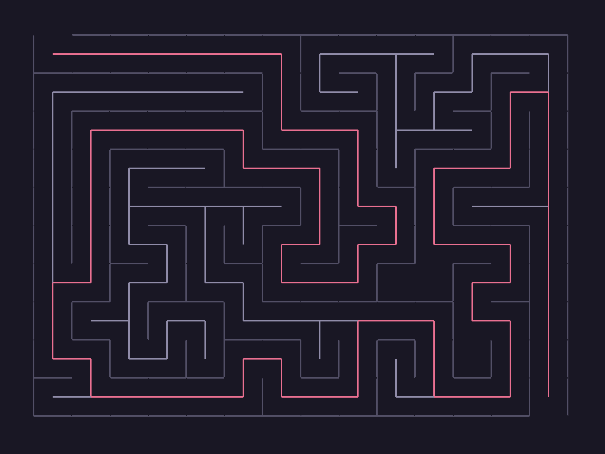

# Maze Solver

This is a maze solver, that draws a random maze, then solves that maze.



## Setup & Usage

### Installation

This project uses Nix flakes. Nix _must_ be installed with the experimental-features `nix-command` and `flakes` enabled.

### Running the Maze Solver

To run the maze solver:

```bash
nix run
```

The maze will be generated to fill the size of the window at the time the `Generate Maze` button is pressed.


### Developing with Nix

To enter a development shell with all the necessary dependencies available:

```bash
nix develop
```

Whilst developing using `nix develop`, there are several commands available:

- `build` - runs the maze solver
- `tests` - executes unit tests for the project
- `format check` - checks code formatting using black
- `format fix` - fixes code formatting using black

## Project Structure

- The `src` directory contains the source code for the maze solver, and is structured as follows:
  - `main.py` is the entry point. This file starts the maze generation and solving!
  - `class_window.py` contains the `Window`, `Point` and `Line` classses, which generates a window and can draw lines.
  - `class_cell.py` contains the `Cell` class, and associated code for drawing the cells, and drawing a "move" between two cells.
  - `class_maze.py` contains the `Maze` class, and the logic for drawing and solving the maze.
- The `tests` directory contains unit tests for the project. There's not too much to test.

## Additional Notes

- I learned that type annotation exist in Python, and I like Rust [insert blazingly-fast meme here], so I have used those liberally.
- I linted this with `basedpyright`, because types.
- The colors used in this theme are from the [Rosé Pine](https://rosepinetheme.com/) palette.

---

This project was built as part of the Maze Solver Course from [Boot.Dev](https://www.boot.dev/courses/build-maze-solver-python)
